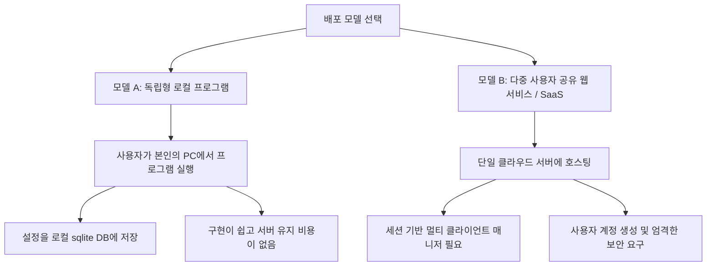

# 리팩토링 계획: 사용자별 Telegram API 자격 증명 지원

이 문서는 사용자의 개인 API 자격 증명(API ID, API HASH, 전화번호)을 노출하지 않고 안전하게 배포할 수 있도록 Telegram UI 프로그램을 개편하기 위한 아키텍처 변경 및 리팩토링 방안을 담고 있습니다.

---

## 1. 현재 아키텍처 분석

현재 [app.py](file:///C:/tele/app.py)는 **단일 로컬 사용자**를 위해 설계되어 있습니다:
* **정적 환경 변수 로드**: 서버 시작 시 로컬 `.env` 파일에서 `TELEGRAM_API_ID`, `TELEGRAM_API_HASH`, `TELEGRAM_PHONE`을 가져옵니다.
* **단일 클라이언트 인스턴스**: [TelegramService](file:///C:/tele/app.py#L326)가 메모리 상에 단 하나의 `TelegramClient` 인스턴스만 생성하고 관리합니다.
* **하드코딩된 세션 저장소**: 프로젝트 루트 폴더의 단일 파일 `telegram_user.session`에 인증 토큰을 저장합니다.
* **동시성 락**: 하나의 전역 `asyncio.Lock()`을 사용하여 모든 요청을 직렬화하므로, 여러 사용자가 동시에 사용할 경우 심각한 병목 현상이 발생합니다.

---

## 2. 배포 모델 제안

사용자가 직접 본인의 Telegram API 정보를 입력하도록 지원하기 위해 아래 두 가지 배포 모델을 검토해 볼 수 있습니다:



### 모델 A: 독립형 로컬 프로그램 (간편한 배포에 권장)
각 사용자가 이 프로그램을 내려받아 자신의 컴퓨터(데스크톱 앱, CLI 또는 로컬 Docker 컨테이너)에서 직접 실행하는 방식입니다.
* **장점**: 코드 수정이 간단하고, 배포자에 대한 호스팅 서버 유지 비용이 없으며, 사용자 세션 데이터가 사용자 본인의 PC 외부로 나가지 않아 개인정보보호 측면에서 완벽합니다.
* **단점**: 사용자가 직접 파이썬 환경을 실행하거나 컴파일된 패키지를 다운로드해야 합니다.

### 모델 B: 다중 사용자 공유 웹 서비스 (SaaS 형태)
하나의 서버를 클라우드에 띄워두고, 사용자들이 브라우저를 통해 접속하여 각자의 Telegram API 정보를 입력하고 연동하는 방식입니다.
* **장점**: 사용자 편의성이 극대화됩니다. 설치할 필요 없이 웹사이트 접속만으로 사용이 가능합니다.
* **단점**: 백엔드 구현이 매우 복잡해집니다. 여러 명의 동시 접속과 Telethon 클라이언트를 처리해야 하며, 사용자 세션 파일이 내 서버에 저장되므로 개인정보 유출에 대한 법적/보안적 책임이 따르고 호스팅 비용이 발생합니다.

---

## 3. 모델 A(독립형 로컬 프로그램) 개발 계획

이 모델을 적용하는 경우, 프로그램이 `.env` 파일 의존성을 버리고 로컬 SQLite DB 기반으로 동작하도록 수정해야 합니다.

### 1단계: DB 기반의 설정 저장소 연동
1. [app.py](file:///C:/tele/app.py#L147)의 `init_db()`를 수정하여 사용자의 API 정보를 저장할 수 있는 설정을 확장합니다.
2. 실행 시 `.env` 파일이 없다면 크래시가 나는 대신, 웹 페이지에 **"최초 API 설정 화면"**이 나타나도록 예외 처리를 수행합니다.
3. 사용자가 입력한 `api_id`와 `api_hash`를 로컬 데이터베이스(`tele_settings.db`)에 안전하게 저장합니다.

### 2단계: 웹 UI 설정 화면 보완
1. `index.html` 설정 창 영역에 "API 자격 증명 설정" 섹션을 신설합니다.
2. 설정이 완료되면 백엔드에서 `TelegramClient` 인스턴스를 동적으로 재생성합니다.

---

## 4. 모델 B(다중 사용자 웹 서비스) 개발 계획

단일 서버에서 여러 사용자 세션을 구분하여 연동하기 위한 설계안입니다.

### 1단계: 클라이언트 인스턴스 매니저 도입
`TelegramService`가 단일 클라이언트를 보유하는 대신, 브라우저 세션 ID와 일치하는 개별 `TelegramClient` 인스턴스 맵을 관리하도록 변경합니다.

```python
class TelegramService:
    def __init__(self):
        self.loop = asyncio.new_event_loop()
        # 세션별 클라이언트 매핑
        self.clients = {}  # { session_token: TelegramClient }
        self.locks = {}    # { session_token: asyncio.Lock() }
```

### 2단계: 세션 격리
1. 사용자가 웹 UI로 로그인/접속 시 고유한 `session_token`을 쿠키 또는 로컬 스토리지에 발행합니다.
2. 각 사용자의 세션 파일을 개별 폴더에 저장합니다:
   ```python
   session_path = ROOT / "sessions" / f"session_{session_token}"
   client = TelegramClient(str(session_path), api_id, api_hash)
   ```
3. API 호출 시 HTTP 요청 헤더의 `Session-Token`을 검증하여 올바른 클라이언트 인스턴스로 바인딩합니다.

### 3단계: 보안 및 통신 보완
* 사용자가 업로드한 `api_hash`를 암호화하여 DB에 기록(예: `cryptography.fernet` 사용).
* 인증 코드가 평문으로 전송되지 않도록 서버에 **HTTPS(SSL)** 통신을 필수로 구성해야 합니다.

---

## 5. 단계별 리팩토링 로드맵 (모델 A 기준 추천)

가장 현실적인 방안으로, 우선 **모델 A(DB 기반의 독립형 환경)**를 구축한 후 필요에 따라 SaaS화를 검토하는 것을 권장합니다.

| 단계 | 수행 작업 | 대상 파일 | 설명 |
|---|---|---|---|
| **1** | 프로그램 시작 시 `.env` 필수값 체크 완화 | `app.py` | API 환경변수가 누락되어 있어도 오류 없이 시작되도록 예외 처리 |
| **2** | API 자격 증명 설정 UI 제공 | `web/index.html`, `web/app.js` | 사용자가 웹 브라우저 내 설정 창에서 자신의 API ID/Hash를 입력할 수 있게 UI 추가 |
| **3** | 로컬 데이터베이스 연동 | `app.py` | 입력받은 자격 증명을 `tele_settings.db`에 영구 저장 및 로드 |
| **4** | 동적 클라이언트 초기화 구현 | `app.py` | 설정이 업데이트되는 즉시 실행 중인 텔레그램 세션을 재생성하는 로직 구현 |
| **5** | 배포용 패키징 (선택 사항) | 없음 | 일반 사용자가 실행하기 쉽도록 PyInstaller 또는 Docker Compose로 묶어 배포 |

---

계획을 읽어보시고 **모델 A(설치형 독립 프로그램)**와 **모델 B(중앙 호스팅 SaaS)** 중 어떤 방식으로 작업을 진행할지 말씀해주시면 바로 해당 구현을 반영하겠습니다!
